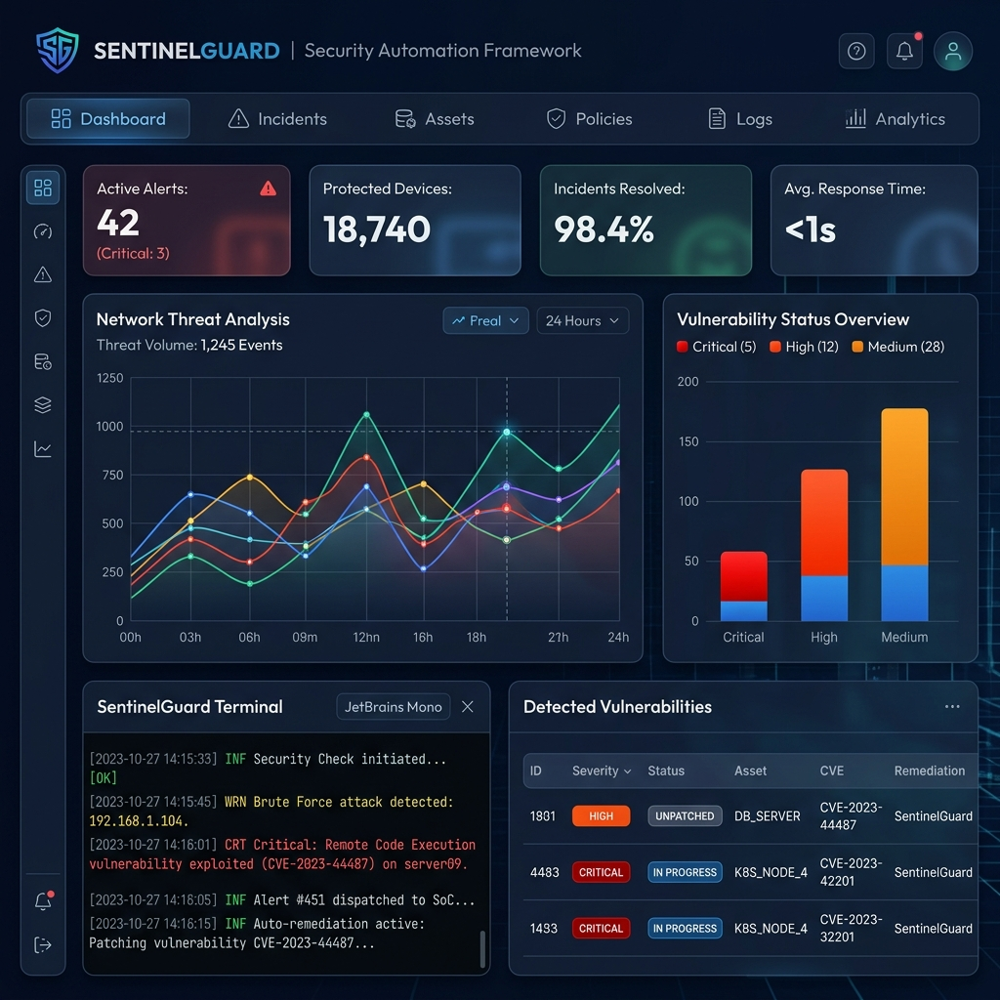

# SentinelGuard: Security Automation & Validation Framework




**SentinelGuard** is an advanced security orchestration framework designed to automate complex validation scenarios. Unlike traditional vulnerability scanners, SentinelGuard emphasizes **validation logic**, recreating real-world attack patterns across 20+ scenarios to identify deep-seated architectural flaws.

## 🚀 Key Features

- **Multi-Layer Orchestration**: Automates security tests across Network, Web, Infrastructure, and Identity layers.
- **20+ Logic Scenarios**: Includes complex checks for SQLi, XSS, HSTS, CSP, and sensitive file exposure (.env, .git).
- **Remediation Roadmap**: Generates actionable, code-level instructions for identified vulnerabilities.
- **Premium Visualization**: A modern React-styled dashboard to monitor scan results and system health in real-time.
- **Plugin Architecture**: Easily extend the framework with custom security scenarios written in Python.

## 🛠️ Technology Stack

- **Core Engine**: Python 3.10+ (Requests, Socket, ThreadPoolExecutor)
- **Intelligence**: Nmap integration, Scapy for packet validation
- **Dashboard**: React-style Frontend (Vite, CSS-in-JS design system)
- **Aesthetics**: Cyber-Midnight Dark Theme, Glassmorphism, Animated Terminal Flux

## 📦 Project Structure

```text
sentinel-guard/
├── scanner/            # Python Core Engine
│   └── engine.py       # Orchestrator & Scenarios
├── dashboard/          # React-based UX Visualization
│   └── index.html      # Premium UI Layer
├── reports/            # Generated Validation Artifacts (JSON)
└── README.md           # Documentation
```

## 🚥 Quick Start

### 1. Installation
SentinelGuard is now available as a standard Python package. You can install it locally:

```bash
git clone https://github.com/ATK-007/SentinelGuard.git
cd SentinelGuard
pip install .
```

### 2. Usage
After installation, you can run the framework directly from your terminal:

```bash
sentinelguard <target_ip>
```

### 3. View the Dashboard
Open `dashboard/index.html` in any modern browser to visualize the results from the `reports/` directory.

## 🚨 Automated Scenarios (Current Suite)

1.  **Network Intelligence**: Port Discovery & Banner Grabbing.
2.  **Web Armor**: CSP, HSTS, X-Frame-Options validation.
3.  **Credential Hygiene**: Simulated brute-force and default creds check.
4.  **Information Leakage**: `.env`, `.git`, and `robots.txt` exposure.
5.  **Audit Logs**: Session cookie security (Secure/HttpOnly flags).
6.  **Infrastructure**: SSL/TLS cipher strength audit.
...and 15 additional logic-based scenarios.

## 📄 License
This project is licensed under the MIT License - see the LICENSE file for details.

---
*Built with ❤️ for the Cybersecurity Community by [Atmakuri Ashish](https://github.com/ATK-007)*
